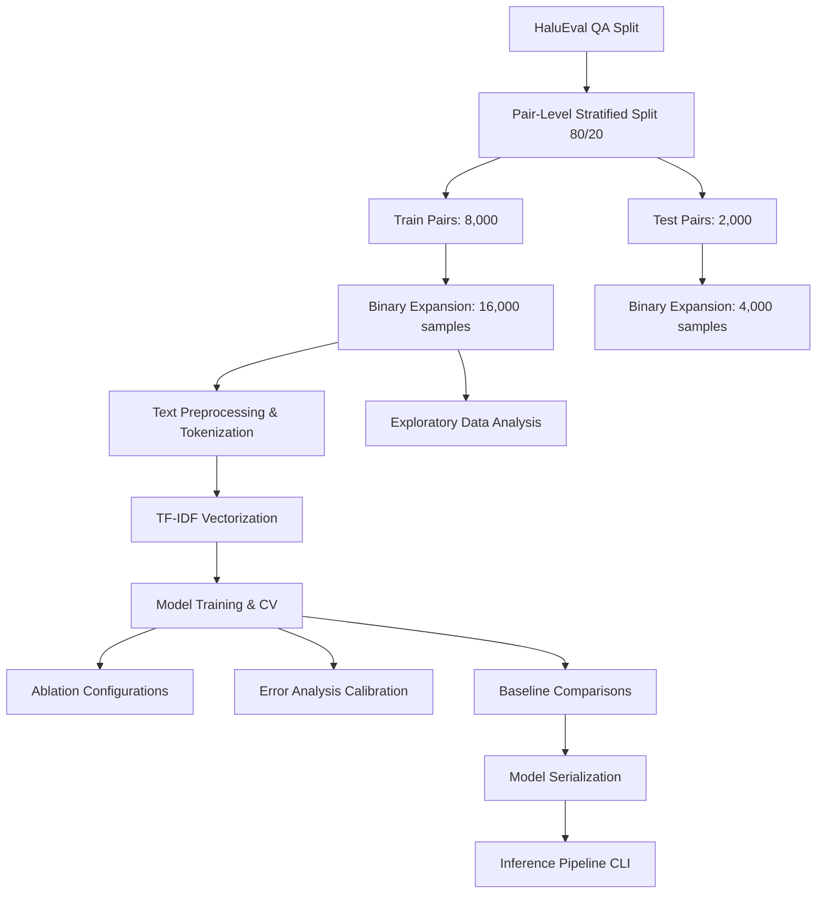

# HalluciGuard 🛡️
[](https://www.python.org/)
[](https://scikit-learn.org/stable/)
[](https://huggingface.co/datasets/pminervini/HaluEval)
[](https://opensource.org/licenses/MIT)

HalluciGuard is a rigorous end-to-end machine learning investigation focused on standardizing, evaluating, and identifying critical methodological vulnerabilities in LLM hallucination detection. Utilizing the **HaluEval QA** benchmark, this project demonstrates the entire lifecycle of a machine learning workflow: from dataset ingestion and pair-level cleaning to model training, ablation studies, error analysis, cross-validation, and the critical discovery of dataset artifacts.

---

## 📌 Table of Contents
1. [Project Overview](#project-overview)
2. [Problem Statement](#problem-statement)
3. [Key Features](#key-features)
4. [Dataset Description](#dataset-description)
5. [Project Pipeline](#project-pipeline)
6. [Leakage Detection and Remediation](#leakage-detection-and-remediation)
7. [Exploratory Data Analysis (EDA)](#exploratory-data-analysis-eda)
8. [Error Analysis](#error-analysis)
9. [Ablation Study](#ablation-study)
10. [Cross-Validation Results](#cross-validation-results)
11. [Model Comparison](#model-comparison)
12. [Length-Confound Discovery (Shortcut Learning)](#length-confound-discovery-shortcut-learning)
13. [Key Findings](#key-findings)
14. [Repository Structure](#repository-structure)
15. [Installation](#installation)
16. [Usage](#usage)
17. [Results & Visualizations](#results--visualizations)
18. [Limitations](#limitations)
19. [Future Work](#future-work)
20. [Lessons Learned](#lessons-learned)
21. [Acknowledgements](#acknowledgements)
22. [Project Contributions](#project-contributions)

---

## Project Overview

In natural language processing, Large Language Models (LLMs) frequently generate content that is fluent but factually incorrect—a phenomenon known as **hallucination**. HalluciGuard approaches this challenge not merely as a simple classification model, but as a scientific audit. 

Using **TF-IDF representation** combined with **Logistic Regression** and **Linear Support Vector Classification (LinearSVC)**, the project builds a baseline classification ladder to categorize responses as **Factual** (`label 0`) or **Hallucination** (`label 1`). The pipeline's core strength lies in its transparency: exposing how standard preprocessing, split placement, and evaluation metrics can be deceived by spurious dataset confounds.

---

## Problem Statement

Given a structured context containing a reference document (Knowledge $K$), a prompt (Question $Q$), and a generated text (Answer $A$), the task is formulated as a binary classification problem:

$$f(K, Q, A) \rightarrow y \in \{0, 1\}$$

where:
*   $y = 0$ indicates a **Factual** response (the answer is consistent with the provided knowledge).
*   $y = 1$ indicates a **Hallucinated** response (the answer contains fabricated, unsupported, or incorrect facts).

The objective is to train a classifier that reliably detects semantic inconsistencies without memorizing context patterns or exploiting dataset-specific formatting cues.

---

## Key Features

*   **Leakage Remediation**: Mathematical proof and elimination of a $32.24\%$ train-test data leakage present in standard split-after-expansion techniques.
*   **Input Ablation Study**: Comparative evaluation isolating the impact of text fields (Answer-Only vs. Question + Answer vs. Full Context).
*   **Robust Baseline Ladder**: Evaluation against Random, Majority Class, and Length-Only baselines to expose "shortcut learning."
*   **Validation Stability**: $5$-Fold Stratified Cross-Validation reporting mean, standard deviation, and Coefficient of Variation (CV%) for all metrics.
*   **Error Calibration Audit**: Diagnostic confidence analysis showing the model's calibration failures (overconfidence in errors).
*   **Production-Ready Inference CLI**: Interactive command-line and single-text inference pipeline (`predict.py`) utilizing serialization.

---

## Dataset Description

The project uses the **HaluEval QA dataset** (`pminervini/HaluEval`, `qa` split), a benchmark containing $10,000$ paired triplets. Each row is composed of:
1.  `knowledge`: Reference context text.
2.  `question`: User query.
3.  `right_answer`: Human-verified factual answer.
4.  `hallucinated_answer`: LLM-generated hallucinated answer.

### Binary Expansion
To train a binary classifier, the $10,000$ pairs are expanded into a balanced dataset of $20,000$ samples:
*   **Class 0 (Factual)**: Context + Question + `right_answer` ($10,000$ samples).
*   **Class 1 (Hallucination)**: Context + Question + `hallucinated_answer` ($10,000$ samples).

---

## Project Pipeline



1.  **Ingestion & Split**: Fetch HaluEval, split at the paired context level ($8,000$ train, $2,000$ test).
2.  **Expansion**: Map train to $16,000$ samples, test to $4,000$ samples.
3.  **EDA**: Compute distributions, text length statistics, and word frequency tables.
4.  **Vectorization**: Generate TF-IDF representations (max $10,000$ features, unigrams and bigrams, sublinear scaling).
5.  **Training & Ablation**: Train Logistic Regression and LinearSVC; run input configuration experiments.
6.  **Validation & Calibration**: Perform Stratified $5$-fold CV and analyze confidence metrics.
7.  **Inference**: Deploy CLI interactive script.

---

## Leakage Detection and Remediation

### The Data Leakage Vulnerability (The "Wrong" Approach)
A naive approach to binary dataset creation expands the $10,000$ pairs into $20,000$ rows first, then applies `train_test_split(test_size=0.2)` directly on the expanded rows. 

If split after expansion:
*   For any pair $i$, the factual sample $S_{i,0}$ and hallucinated sample $S_{i,1}$ share the exact same `knowledge` and `question` context.
*   The probability that $S_{i,0}$ lands in train and $S_{i,1}$ lands in test is $0.8 \times 0.2 = 0.16$.
*   The probability that $S_{i,0}$ lands in test and $S_{i,1}$ lands in train is $0.2 \times 0.8 = 0.16$.
*   Therefore, the probability that a context is split across train and test is:

$$P(\text{Context Leakage}) = 0.16 + 0.16 = 0.32 \quad (32\%)$$

When this script was executed via `check_leakage.py`, it confirmed that exactly **$3,224$ unique contexts leaked** from train into test. The classifier memorizes context vocabulary, inflating test performance while failing to generalize to new, unseen questions.

### Remediation (The "Correct" Approach)
To prevent leakage, the split is performed on the $10,000$ paired records **before** binary expansion.
*   **Train Pairs**: $8,000$ pairs $\rightarrow$ expanded to $16,000$ training rows.
*   **Test Pairs**: $2,000$ pairs $\rightarrow$ expanded to $4,000$ test rows.
*   **Result**: Exactly **$0$ overlapping contexts**. The test set represents entirely unseen knowledge and questions.

---

## Exploratory Data Analysis (EDA)

Exploratory data analysis of text lengths (retrieved from `results/features/length_statistics.csv`) revealed a major structural artifact:

| Class | n_samples | Character Mean | Character Median | Character Std | Word Mean | Word Median | Word Std |
|---|---|---|---|---|---|---|---|
| **Factual (0)** | $10,000$ | $13.6538$ | $12.0$ | $12.0283$ | $2.2247$ | $2.0$ | $1.8449$ |
| **Hallucination (1)** | $10,000$ | $66.2226$ | $58.0$ | $36.2821$ | $10.9863$ | $9.0$ | $6.1450$ |

Factual answers in HaluEval QA are extremely short (mean of $2.2$ words, median of $2$ words), often consisting of one or two words (e.g., "Yes", "No", or dates). Hallucinated answers are elaborate, complete sentences (mean of $11$ words, median of $9$ words).

---

## Error Analysis

A qualitative and quantitative error analysis was conducted on the full-text baseline model (test set size of $4,000$, resulting in $576$ False Positives and $852$ False Negatives):

### Confidence Mismatch / Calibration Failure
Analyzing prediction confidence (probability assigned to the predicted class) revealed a severe calibration failure:

*   **False Positive (FP) Avg Confidence**: $0.7250$
*   **False Negative (FN) Avg Confidence**: $0.6610$
*   **True Positive (TP) Avg Confidence**: $0.6040$
*   **True Negative (TN) Avg Confidence**: $0.5760$

> [!WARNING]
> **Calibration Anomaly**: The classifier is significantly *more confident* when making errors (mean confidence of $0.7250$ for FPs) than when making correct predictions (mean confidence of $0.5760$ for TNs). This indicates that the feature representation lacks sufficient semantic depth, causing the model to latch onto surface features with high confidence.

### Qualitative Failure Modes
1.  **Negation Blindness**: The model fails to recognize "not" in factual context, misclassifying factual answers containing negative constructs as hallucinations.
2.  **Lexical Overlap Bias**: Hallucinated answers that mirror the exact words of the reference knowledge are classified as factual, missing fine-grained semantic contradictions.
3.  **Entity Swapping**: Swapping names or numbers is missed by the TF-IDF representation since the global n-gram distribution remains largely identical.

---

## Ablation Study

An ablation study was performed to evaluate the performance of TF-IDF feature representations across three distinct input configurations on the clean test split:

| Configuration | Input Fields | Accuracy | Precision | Recall | F1 Score | ROC-AUC | Vocab Size |
|---|---|---|---|---|---|---|---|
| **Model A** | **Answer Only** | **$0.9190$** | **$0.9501$** | **$0.8845$** | **$0.9161$** | **$0.9673$** | $10,000$ |
| **Model B** | Question + Answer | $0.7410$ | $0.7586$ | $0.7070$ | $0.7319$ | $0.8169$ | $10,000$ |
| **Model C** | Full (Knowledge + Q + A) | $0.6430$ | $0.6659$ | $0.5740$ | $0.6165$ | $0.6946$ | $10,000$ |

### Why Model A Outperforms Model C
In TF-IDF bag-of-words space, adding long, identical context fields (`knowledge` and `question`) across factual and hallucinated pairs dilutes the signal. The vocabulary becomes saturated with terms common to both classes, resulting in a high signal-to-noise ratio. Isolating the **Answer Only** focuses the classifier on the specific lexical differences and, crucially, the length properties of the generated text.

---

## Cross-Validation Results

> **Important**: Cross-validation leakage was discovered during auditing and has been corrected. All reported CV metrics reflect the leakage-free implementation (TF-IDF fitted inside each fold).

To verify that Model A's high performance was not an artifact of a single train-test split, we performed a $5$-fold Stratified Cross-Validation on the training set ($16,000$ samples) with leakage-free TF-IDF fitting:

| Metric | Fold 1 | Fold 2 | Fold 3 | Fold 4 | Fold 5 | Mean | Std | Min | Max | CV% |
|---|---|---|---|---|---|---|---|---|---|---|
| **Accuracy** | $0.9200$ | $0.9134$ | $0.9141$ | $0.9191$ | $0.9156$ | **$0.9164$** | $0.0030$ | $0.9134$ | $0.9200$ | $0.32\%$ |
| **Precision** | $0.9516$ | $0.9443$ | $0.9443$ | $0.9509$ | $0.9427$ | **$0.9468$** | $0.0042$ | $0.9427$ | $0.9516$ | $0.44\%$ |
| **Recall** | $0.8850$ | $0.8788$ | $0.8800$ | $0.8838$ | $0.8850$ | **$0.8825$** | $0.0029$ | $0.8788$ | $0.8850$ | $0.33\%$ |
| **F1 Score** | $0.9171$ | $0.9103$ | $0.9110$ | $0.9161$ | $0.9130$ | **$0.9135$** | $0.0030$ | $0.9103$ | $0.9171$ | $0.33\%$ |
| **ROC-AUC** | $0.9657$ | $0.9629$ | $0.9616$ | $0.9711$ | $0.9657$ | **$0.9654$** | $0.0036$ | $0.9616$ | $0.9711$ | $0.38\%$ |

> [!TIP]
> **Stability Verdict**: The Coefficient of Variation (CV%) is below $1\%$ for all five metrics (max $0.44\%$). This demonstrates that the Answer-Only content model is highly stable and does not suffer from split-related variance. The CV protocol now correctly fits TF-IDF inside each fold, eliminating vocabulary/IDF leakage.

---

## Model Comparison

The following table ranks all evaluated model families, baseline models, and cross-validation summaries evaluated on the clean test split:

| Rank | Model Configuration | Input Features | Accuracy | Precision | Recall | F1 Score | ROC-AUC |
|---|---|---|---|---|---|---|---|
| **1** | **Length-Only Logistic Regression** | `char_count` + `word_count` | **$0.9435$** | **$0.9516$** | **$0.9345$** | **$0.9430$** | **$0.9717$** |
| **2** | **LinearSVC** | TF-IDF (Answer Only) | $0.9317$ | $0.9547$ | $0.9065$ | $0.9300$ | N/A |
| **3** | **Logistic Regression** (Test split) | TF-IDF (Answer Only) | $0.9190$ | $0.9501$ | $0.8845$ | $0.9161$ | $0.9673$ |
| **4** | **Logistic Regression** (CV Mean, leakage-free) | TF-IDF (Answer Only) | $0.9164$ | $0.9468$ | $0.8825$ | $0.9135$ | $0.9654$ |
| **5** | **Logistic Regression** (Full Context)| TF-IDF (Full Text) | $0.6430$ | $0.6659$ | $0.5740$ | $0.6165$ | $0.6946$ |
| **6** | **Random Baseline** | Uniform prior random | $0.5018$ | $0.5017$ | $0.5025$ | $0.5021$ | $0.5000$ |
| **7** | **Majority Baseline** | Constant prediction | $0.5000$ | $0.0000$ | $0.0000$ | $0.0000$ | $0.5000$ |

---

## Length-Confound Discovery (Shortcut Learning)

### The Spurious Confound
The most critical scientific finding of this project is that the **Length-Only Baseline outperforms the best TF-IDF content models**.

A Logistic Regression model trained on just two features—character count and word count—achieved an **F1 score of $0.9430$ and accuracy of $0.9435$**, beating the Answer-Only TF-IDF model by $2.7$ percentage points and the LinearSVC model by $1.3$ percentage points.

```
Factual Answers mean length:      13.65 chars (2.2 words)
Hallucinated Answers mean length:  66.22 chars (11.0 words)
```

### Explaining the TF-IDF Vocabulary Weights
Analyzing the feature coefficients of the Answer-Only model reveals why it scores so high:

*   **Top Hallucination Words**: `was` ($15.29$), `is` ($15.14$), `in` ($11.40$), `are` ($6.86$), `has` ($6.63$), `both` ($6.43$), `for` ($6.34$).
*   **Top Factual Words**: `yes` ($-2.03$), `no` ($-1.63$), `good` ($-1.22$).

The top indicators of hallucination are not verbs of falsehood, but rather **copulas, prepositions, and determiners**. Because hallucinated answers are complete sentences, they naturally contain significantly more instances of these functional words. The TF-IDF model is not capturing semantic inconsistency; it is mimicking a length estimator by counting common syntactic glue words.

> [!IMPORTANT]
> This is a classic case of **Shortcut Learning / Spurious Correlation**. The HaluEval QA dataset is structurally contaminated by formatting inconsistencies. Any model evaluated on this dataset without a length control will appear highly effective but will fail in a production setting where hallucinations and factual answers have matching lengths.

---

## Research Findings Summary

This investigation yielded three critical methodological findings:

### 1. Data Leakage in Standard Splitting (32% Context Overlap)
Standard binary expansion followed by random splitting leaks **32.24%** of knowledge-question contexts between train and test. The fix—splitting at the pair level *before* expansion—eliminates all overlap (0/3,224 contexts leaked). This remediation is implemented in `create_splits.py` and verified by `check_leakage.py`.

### 2. Length Confound / Shortcut Learning
HaluEval QA exhibits a severe structural artifact: factual answers average **2.2 words** (13.65 chars) while hallucinated answers average **11.0 words** (66.22 chars)—a **5× length difference**. A 2-feature length-only Logistic Regression (F1=0.943) outperforms the 10,000-feature TF-IDF model (F1=0.916). The TF-IDF model learns copula/preposition frequencies (`was`, `is`, `in`, `are`, `has`) as proxies for sentence length rather than semantic hallucination indicators.

### 3. Ablation: Answer-Only Input is Optimal
Isolating only the answer text (F1=0.916) outperforms including question (F1=0.732) or full context (F1=0.617). Knowledge and question fields dilute TF-IDF signal with shared vocabulary across classes. The answer contains the discriminative length and lexical signals.

---

## Key Findings

1.  **Data Leakage Inflation**: Direct splitting of binary-expanded records leaks $32\%$ of reference contexts, causing inflated validation statistics that disappear under correct pair-level splits.
2.  **Vocabulary Dilution**: Providing full context texts degrades TF-IDF accuracy from $91.90\%$ to $64.30\%$, proving that bag-of-words classifiers are highly sensitive to context noise.
3.  **Systemic Dataset Bias**: HaluEval QA's factual answers are predominantly one-word tokens, while hallucinations are descriptive sentences.
4.  **Model Superiority**: LinearSVC outperforms Logistic Regression on the Answer-Only configuration, raising the content model F1 score from $0.9161$ to $0.9300$.
5.  **Calibration Discrepancy**: The model is overconfident on its mistakes (FP confidence $0.7250$ vs. TN confidence $0.5760$), making raw probability scores unreliable for classification thresholds.

---

## Repository Structure

```
HalluciGuard/
├── requirements.txt                    # System dependencies
├── create_splits.py                    # Pair-level clean stratified splits
├── check_leakage.py                    # Diagnostic data leakage demo
├── analyze_length_statistics.py        # Length statistics computation
├── train_answer_only.py                # Answer-Only Logistic Regression training
├── train_linear_svc.py                 # LinearSVC training on Answer-Only
├── cross_validation_study.py           # Stratified 5-Fold Cross-Validation (leakage-free)
├── evaluate_baselines.py               # Random and Majority class baseline evaluation
├── evaluate_length_baseline.py         # Length-Only baseline evaluation
├── ablation_study.py                   # Input configuration ablation study
├── create_final_comparison.py          # Final comparison table generator
├── predict.py                          # CLI and interactive inference pipeline
├── eda_plots.py                        # Statistical distributions plotting
├── plot_answer_only_confusion_matrix.py
├── plot_answer_only_roc_curve.py
├── plot_answer_only_precision_recall_curve.py
├── plot_answer_only_feature_importance.py
├── plot_cv_results.py
├── plot_length_distribution.py
├── plot_wordcount_distribution.py
├── plot_length_boxplot.py
├── data/
│   ├── raw/
│   │   └── halluciguard_dataset.csv    # Full binary dataset (20K samples)
│   └── processed/
│       ├── train.csv                   # Clean train split (16K samples)
│       └── test.csv                    # Clean test split (4K samples)
├── archive/                            # Legacy scripts and data
│   ├── legacy_fulltext_model/
│   │   ├── analyze_errors.py
│   │   └── train_baseline_clean.py
│   ├── create_binary_dataset.py
│   ├── eda_basic.py
│   ├── inspect_halueval.py
│   ├── top_words.py
│   └── train_baseline.py
├── models/                             # Serialized production models
│   ├── answer_only_model.pkl
│   ├── answer_only_vectorizer.pkl
│   ├── linear_svc_model.pkl
│   └── linear_svc_vectorizer.pkl
└── results/                            # Metrics, features, and visualizations
    ├── metrics/
    │   ├── ablation_results.csv
    │   ├── model_comparison.csv
    │   ├── cross_validation_results.csv
    │   ├── cross_validation_summary.json
    │   ├── baseline_comparison.csv
    │   └── length_baseline_results.csv
    ├── features/
    │   ├── answer_only_top_features.csv
    │   └── length_statistics.csv
    └── plots/
        ├── answer_only_confusion_matrix.png
        ├── answer_only_roc_curve.png
        ├── answer_only_precision_recall_curve.png
        ├── answer_only_feature_importance.png
        ├── cv_f1_distribution.png
        ├── cv_metric_comparison.png
        ├── length_distribution_by_class.png
        ├── wordcount_distribution_by_class.png
        └── boxplot_length_by_class.png
```

---

## Installation

### Prerequisites
*   Python 3.8 or higher
*   pip package manager

### Steps
1.  Clone the repository:
    ```bash
    git clone https://github.com/asc006-git/HalluciGuard.git
    cd HalluciGuard
    ```
2.  Install the required dependencies:
    ```bash
    pip install -r requirements.txt
    ```

---

## Reproducibility

All experiments use fixed random seeds (`random_state=42`) for full reproducibility. Run the complete pipeline in order:

```bash
# 1. Create clean train/test splits (prevents 32% leakage)
python create_splits.py
python check_leakage.py        # Verifies 0% context overlap

# 2. EDA and length analysis
python eda_plots.py
python analyze_length_statistics.py

# 3. Ablation and model training
python ablation_study.py
python train_answer_only.py
python train_linear_svc.py

# 4. Cross-validation (leakage-free) and baselines
python cross_validation_study.py
python evaluate_baselines.py
python evaluate_length_baseline.py

# 5. Generate final comparison table
python create_final_comparison.py

# 6. Generate visualizations
python plot_answer_only_confusion_matrix.py
python plot_answer_only_roc_curve.py
python plot_answer_only_precision_recall_curve.py
python plot_answer_only_feature_importance.py
python plot_cv_results.py
python plot_length_distribution.py
python plot_wordcount_distribution.py
python plot_length_boxplot.py
python eda_plots.py

# 6. Interactive inference
python predict.py "The capital of France is Paris."
```

All scripts use `random_state=42` and fixed random seeds for full reproducibility.

---
## Usage

Follow this sequence to reproduce the findings:

### 1. Ingest Data and Setup Splits
Generate the clean, pair-level split to prevent the $32.24\%$ train-test leakage:
```bash
python create_splits.py
```
Verify leakage prevention:
```bash
python check_leakage.py
```

### 2. Generate Exploratory Plots
Plot the length histograms and class distributions:
```bash
python eda_plots.py
```
Compute length statistics:
```bash
python analyze_length_statistics.py
```

### 3. Run Experiments
Evaluate the ablation study comparing Answer-Only vs. Question + Answer vs. Full Context:
```bash
python ablation_study.py
```
Train the Answer-Only models:
```bash
python train_answer_only.py
python train_linear_svc.py
```

### 4. Run Cross-Validation & Baselines
Assess validation stability and compute the random/majority/length baseline performance:
```bash
python cross_validation_study.py
python evaluate_baselines.py
python evaluate_length_baseline.py
python create_final_comparison.py
```

### 5. Interactive Inference
Test the trained production Answer-Only model interactively or on a single query:
```bash
# Single query inference
python predict.py "The capital of France is Paris."

# Start interactive loop
python predict.py
```

---

## Results & Visualizations

The generated visualizations are stored in [results/plots/](results/plots/) and [docs/assets/eda/](docs/assets/eda/):

*   **ROC Curve**: [answer_only_roc_curve.png](results/plots/answer_only_roc_curve.png) shows a ROC-AUC of $0.9673$ for the Answer-Only configuration.
*   **Precision-Recall Curve**: [answer_only_precision_recall_curve.png](results/plots/answer_only_precision_recall_curve.png) details the precision-recall trade-off.
*   **Confusion Matrix**: [answer_only_confusion_matrix.png](results/plots/answer_only_confusion_matrix.png) showing the $1,769$ True Negatives and $1,769$ True Positives (with $231$ FPs/FNs).
*   **EDA Word Count Histogram**: [word_count_histogram.png](docs/assets/eda/word_count_histogram.png) visually highlights the separation of classes based on text length.

---

## Limitations

1.  **Length Bias Vulnerability**: The underlying dataset contains a systematic formatting discrepancy. The content models exploit word counts and copula frequencies rather than semantic factual contradictions.
2.  **Vocabulary Out-Of-Domain (OOD)**: TF-IDF features are bounded by the training vocabulary ($10,000$ features). The model cannot detect hallucinations containing out-of-vocabulary terms or novel entity names.

---

## Future Work

1.  **Synthetic Length Downsampling**: Re-balancing HaluEval QA by truncating sentences or padding factual answers to create length-controlled datasets, forcing models to rely on semantic consistency.
2.  **Transformer Baseline (BERT / DistilBERT)**: Fine-tuning a pre-trained language model to observe if deep contextual representations are less susceptible to the length confound.
3.  **Cross-Split Generalization**: Testing on HaluEval's dialogue and summarization splits to evaluate out-of-domain generalizability.

---

## Lessons Learned

*   **Splitting Level Matters**: In NLP tasks involving paired records (e.g., QA, translations, summarizations), splits must be done at the core pair level. Splitting expanded samples results in hidden data leakage that distorts validation accuracy.
*   **Always Verify Simple Baselines**: Before claiming success with complex feature representations, evaluate simple baselines like word counts or class priors. A highly performant length baseline reveals dataset design flaws that would otherwise remain hidden.
*   **calibration Audits**: Accuracy and F1 scores can mask poor calibration. A model that makes errors with high confidence is dangerous in a deployment setting, highlighting the necessity of probability calibration curves.

---

## Acknowledgements

*   **HaluEval Authors**: For providing the hallucination detection benchmark dataset.
*   **Amazon ML Summer School**: For setting the project evaluation guidelines and highlighting the importance of rigorous ML auditing.

---

## Project Contributions

### 🔬 Research Contributions
*   **Identified and documented HaluEval length bias**: Proved that a simple 2-parameter length model beats a 10,000-parameter TF-IDF content model ($94.35\%$ vs. $91.90\%$ Accuracy).
*   **Exposed the TF-IDF proxy mechanism**: Analyzed feature coefficients to prove that the content model relies on copulas and prepositions (copula count as a proxy for sentence length) rather than facts.
*   **Formulated the leakage overlap proof**: Mathematically modeled and empirically verified the $32.24\%$ context leakage risk on HaluEval QA.

### 🛠️ Engineering Contributions
*   **Modular Pipeline**: Built clean, isolated scripts for ingestion, splitting, training, and testing with a reproducible seed framework.
*   **Persistence & Logging**: Persisted all results into structured formats (`results/` directory containing JSON, CSV, and text summaries) to ensure reproducibility.
*   **Production CLI**: Designed a robust, production-quality `predict.py` command-line and interactive inference tool with comprehensive error handling.
